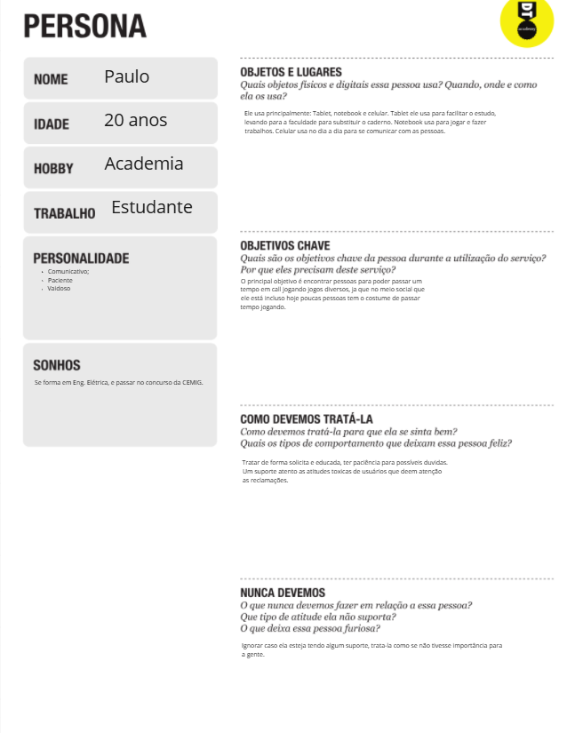
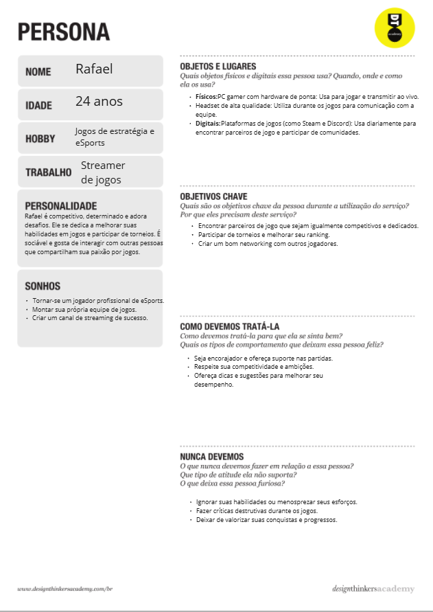
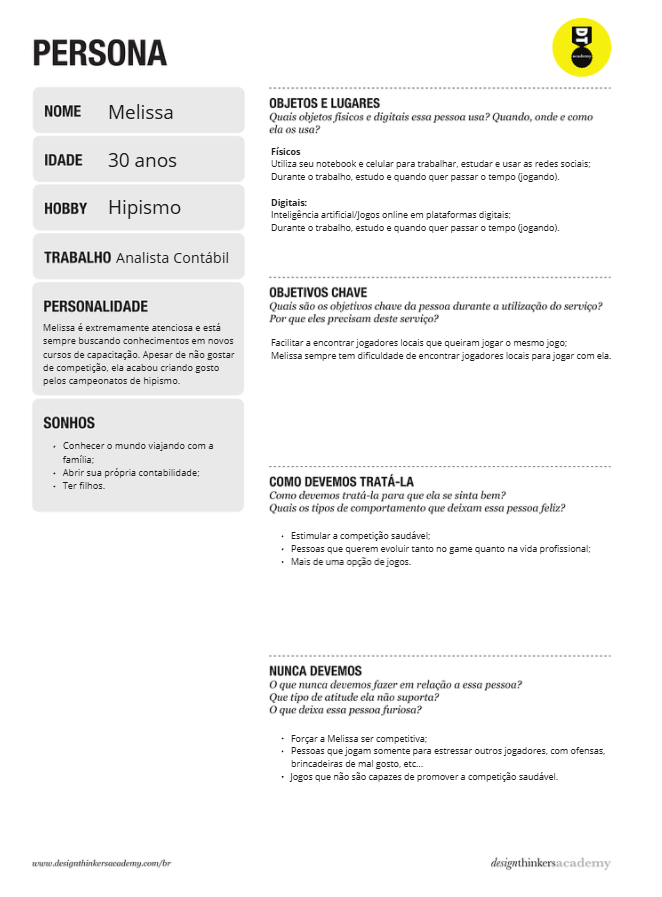
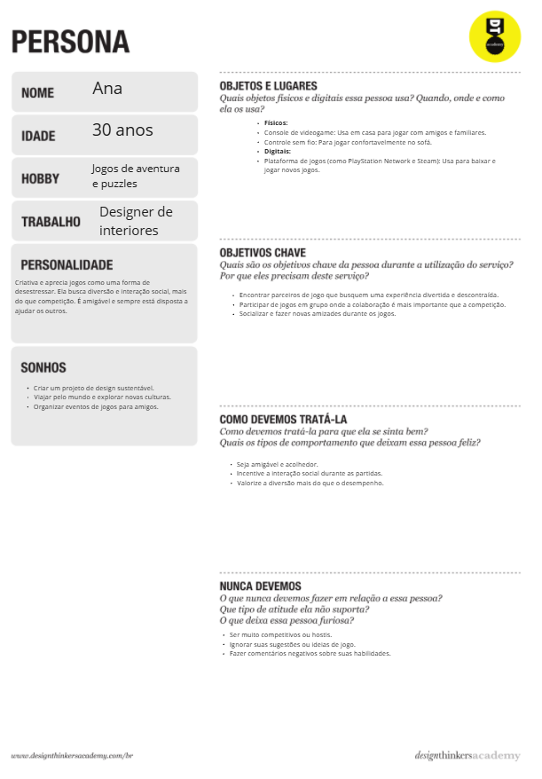

# Product discovery

Pré-requisitos: <a href="01-Contexto.md"> Documentação de contexto</a>

✅ [Documentação de Design Thinking (MIRO)](files/processo-dt.pdf)

## Etapa de entendimento

**✳️✳️✳️ APRESENTE OS ARTEFATOS DA ETAPA  ✳️✳️✳️**

> ⚠️ **APAGUE ESTA PARTE ANTES DE ENTREGAR SEU TRABALHO**
>
> Nesta etapa, é necessário aplicar a metodologia de Design Thinking para compreender de forma mais profunda o problema a ser abordado. Durante esse processo, devem ser elaborados os seguintes elementos:
>
> * **Matriz CSD**:  também conhecida como Matriz de Alinhamento, trata-se de uma ferramenta utilizada no Design Thinking para organizar informações, facilitando a tomada de decisões e a solução de problemas;
> * **Mapa de stakeholders**: ferramenta que permite identificar e entender o grupo de pessoas e entidades que devem ser analisados e consultados para obter uma visão mais ampla do problema;
> * **Entrevistas qualitativas**:
**Pessoa 1 – Julia – 21 anos**

*Você tem dificuldade em achar parceiros ou grupos para jogar?*

Na maioria das vezes

*Como a demora para encontrar um parceiro ou equipe afeta sua experiência de jogo?*

Fico bem frustrada e acabo desistindo

*Se existisse uma plataforma para ajudar a encontrar parceiros de jogo, você usaria?*

Acho que sim, se fosse mais prático

*Quais são seus jogos favoritos? Eles são jogados em equipe ou individualmente?*

Jogo muito truco que é em dupla

*O que seria mais importante para você em uma plataforma de encontro de parceiros de jogo?*

Uma forma de achar alguém que tenha mais ou menos o mesmo nível de jogo que eu e que esteja disponível no mesmo momento

**Pessoa 2 – Luiz – 18 anos**

*Você tem dificuldade em achar parceiros ou grupos para jogar?*

Sim

>*Como a demora para encontrar um parceiro ou equipe afeta sua experiência de jogo?*

Me deixa irritado quando não consigo fechar o grupo pra jogar, porque não gosto de ficar esperando se estou com tempo

*Se existisse uma plataforma para ajudar a encontrar parceiros de jogo, você usaria?*

Sim, seria ótimo

*Quais são seus jogos favoritos? Eles são jogados em equipe ou individualmente?*

Sinuca, geralmente jogo 2x2

*O que seria mais importante para você em uma plataforma de encontro de parceiros de jogo?*

Uma função para encontrar pessoas que tivessem a idade parecida com a minha e já entendam do jogo

**Pessoa 3 – Davi – 14 anos**

*Você tem dificuldade em achar parceiros ou grupos para jogar?*

Sim

*Como a demora para encontrar um parceiro ou equipe afeta sua experiência de jogo?*

Limita o tempo que eu tenho para jogar

*Se existisse uma plataforma para ajudar a encontrar parceiros de jogo, você usaria?*

Usaria

*Quais são seus jogos favoritos? Eles são jogados em equipe ou individualmente?*

Truco e Free Fire

*O que seria mais importante para você em uma plataforma de encontro de parceiros de jogo?*

Eu queria que tivesse as informações sobre a pessoa e sua habilidade no jogo, e um chat para fazer contato

> * **Highlights de pesquisa**: um compilado das informações levantadas durante as entrevistas realizadas.

> **Links úteis**:
> - [Mapa de stalkeholders](https://www.racecomunicacao.com.br/blog/como-fazer-o-mapeamento-de-stakeholders/)

## Etapa de definição

### Personas

**✳️✳️✳️ APRESENTE OS DIAGRAMAS DE PERSONAS ✳️✳️✳️**

> Deve-se relacionar as personas identificadas no projeto, juntamente com os respectivos mapas de empatia. É importante enumerar e descrever de maneira precisa e personalizada todos os principais envolvidos na solução pretendida.

> **Links úteis**:
> - [Rock Content](https://rockcontent.com/blog/personas/)
> - [Criar personas (Hotmart)](https://blog.hotmart.com/pt-br/como-criar-persona-negocio/)
> - [O que é persona?](https://resultadosdigitais.com.br/blog/persona-o-que-e/)
> - [Persona x público-alvo](https://flammo.com.br/blog/persona-e-publico-alvo-qual-a-diferenca/)
> - [Qual a diferença entre público-alvo e persona?](https://rockcontent.com/blog/diferenca-publico-alvo-e-persona/)
