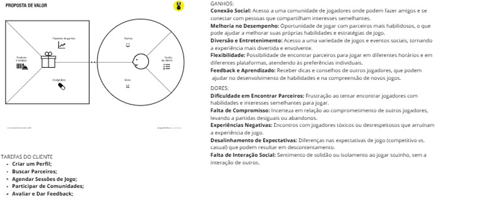
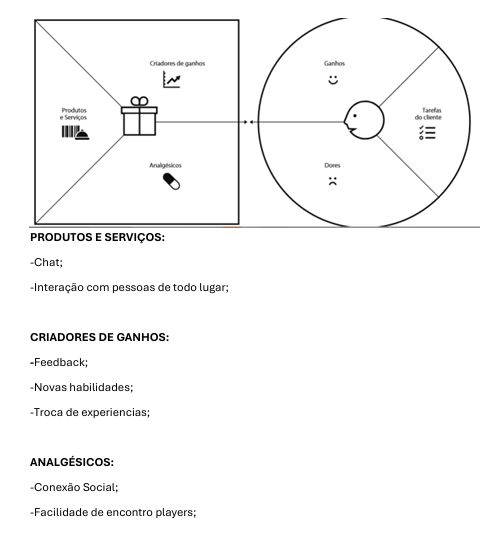

# Product design

Pré-requisitos: <a href="02-Product-discovery.md"> Product discovery</a>

## Histórias de usuários

Com base na análise das personas, foram identificadas as seguintes histórias de usuários:

|EU COMO... `PERSONA`| QUERO/PRECISO ... `FUNCIONALIDADE` |PARA ... `MOTIVO/VALOR`                 |
|--------------------|------------------------------------|----------------------------------------|
|Usuário do sistema  | Função chat          | Me comunicar facilmente com outros usuários      |
|Administrador       | Poder expulsar usuário    | Ajudar a controlar usuários tóxicos |
|Usuário do sistema       | Variedades de jogos    | Jogar vários tipos de jogos |
|Usuário do sistema     | Conseguir avaliar o meu oponente    | Ajudar na classificação do usuário |

> **Links úteis**:
> - [Histórias de usuários com exemplos e template](https://www.atlassian.com/br/agile/project-management/user-stories)
> - [Como escrever boas histórias de usuário (user stories)](https://medium.com/vertice/como-escrever-boas-users-stories-hist%C3%B3rias-de-usu%C3%A1rios-b29c75043fac)
> - [User stories: requisitos que humanos entendem](https://www.luiztools.com.br/post/user-stories-descricao-de-requisitos-que-humanos-entendem/)
> - [Histórias de usuários: mais exemplos](https://www.reqview.com/doc/user-stories-example.html)
> - [9 common user story mistakes](https://airfocus.com/blog/user-story-mistakes/)

## Proposta de valor

> **Links úteis**:
> - [O que é o canvas da proposta de valor e como usar?](https://www.youtube.com/watch?v=Iqb-8Q_eiiA)

## Requisitos

### Requisitos funcionais

| ID     | Descrição do Requisito                                   | Prioridade |
| ------ | ---------------------------------------------------------- | ---------- |
| RF-001 |Chat | ALTA       |
| RF-002 |Ranking do usuário | MÉDIA     |
| RF-003 |Adicionar amigos | MÉDIA     |
| RF-004 |Jogos mais procurados | MÉDIA     |
| RF-005 |Criação de sala | MÉDIA     |
| RF-006 |Favoritos | Alta     |
| RF-007 |Perfil de usuário | Alta     |
| RF-008 | Filtros | MÉDIA     |
| RF-009 | Gerenciamento de sala | Baixa     |
| RF-010 | Fórum | MÉDIA     |
| RF-011 | Suporte | Alta     |
| RF-012 | Localização | Baixissima    |
| RF-013 |Agendar horários | MÉDIA     |

### Requisitos não funcionais

| ID      | Descrição do Requisito                                                              | Prioridade |
| ------- | ------------------------------------------------------------------------------------- | ---------- |
| RNF-001 | O sistema deve ser responsivo  | MÉDIA     |
| RNF-002 | Os links deverão responder em até 5 segundos         | BAIXA      |
| RNF-003 | Somente as pessoas que compõe o grupo irão desenvolver a página web        | Alta      |
| RNF-004 | Não é permitido o uso de back-end ou banco de dados        | Alta     |
| RNF-005 | Suporte 24h         | BAIXA      |
| RNF-006 | Estabilidade na conexão de Wi-Fi dos players        | Alta     |
| RNF-007 | Controle de cheatrs e jogadores toxicos      | BAIXA      |

- [Requisitos funcionais
 (RF)](https://pt.wikipedia.org/wiki/Requisito_funcional):
 correspondem a uma funcionalidade que deve estar presente na
  plataforma (ex: cadastro de usuário).
- [Requisitos não funcionais
  (RNF)](https://pt.wikipedia.org/wiki/Requisito_n%C3%A3o_funcional):
  correspondem a uma característica técnica, seja de usabilidade,
  desempenho, confiabilidade, segurança ou outro (ex: suporte a
  dispositivos iOS e Android).

Lembre-se de que cada requisito deve corresponder a uma e somente uma característica-alvo da sua solução. Além disso, certifique-se de que todos os aspectos capturados nas histórias de usuários foram cobertos.

> **Links úteis**:
> - [O que são requisitos funcionais e requisitos não funcionais?](https://codificar.com.br/requisitos-funcionais-nao-funcionais/)
> - [Entenda o que são requisitos de software, a diferença entre requisito funcional e não funcional, e como identificar e documentar cada um deles](https://analisederequisitos.com.br/requisitos-funcionais-e-requisitos-nao-funcionais-o-que-sao/)

## Restrições

Enumere as restrições à sua solução. Lembre-se de que as restrições geralmente limitam a solução candidata.

O projeto está restrito aos itens apresentados na tabela a seguir.

|ID| Restrição                                             |
|--|-------------------------------------------------------|
|001| O projeto deverá ser entregue até o final do semestre  |
|002| Não é permitido o desenvolvimento de um módulo de back-end  |
